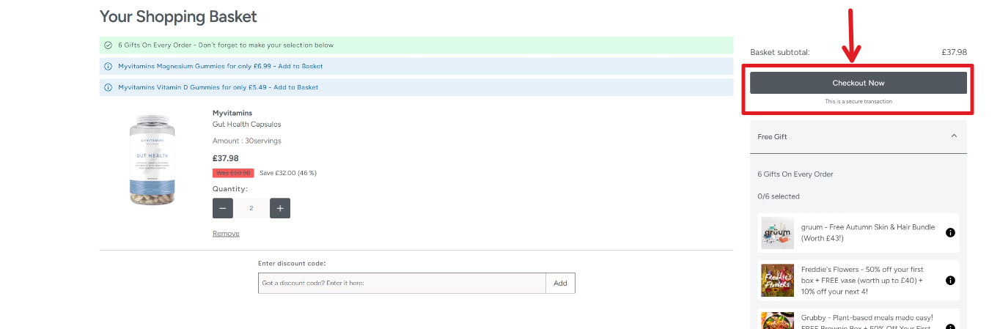
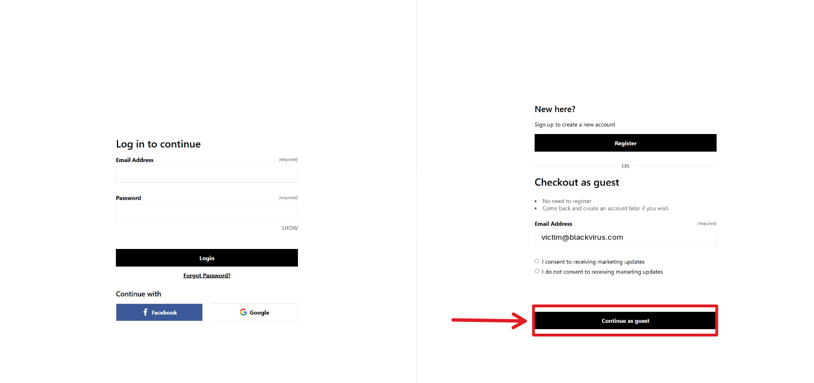
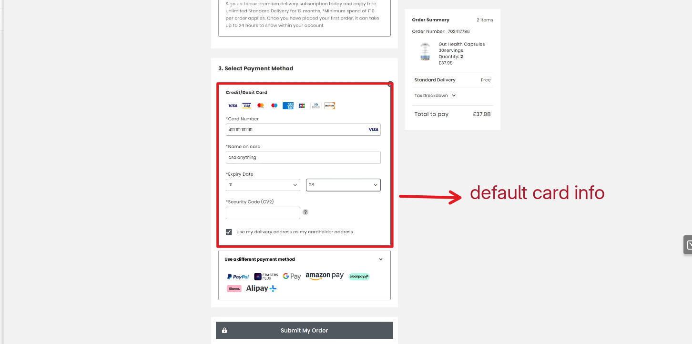
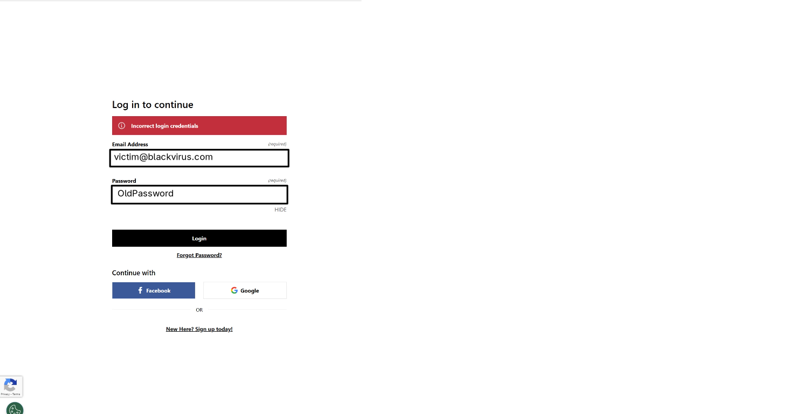
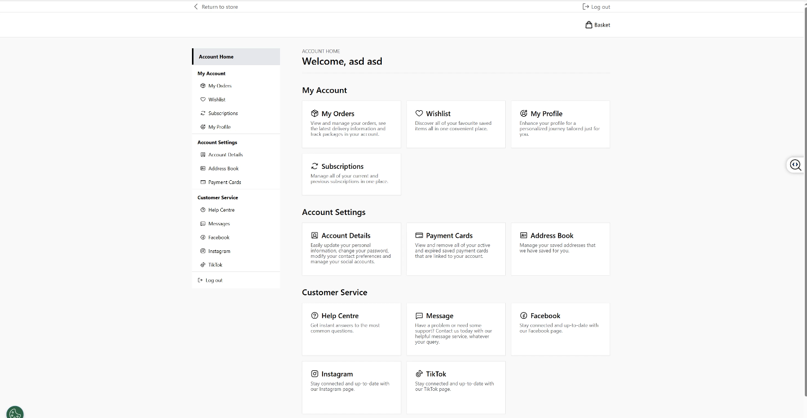

# Account Takeover & Deletion via Guest Checkout Vulnerability 
## Hay Hunters , Hello Infosec Community
To Introduce My Self:
My name is Yazeed Alewah , Part time bug hunter & Pentester known as Black virus 
[Twitter]
[Linkedin]
[Bugcrowd]

Lets dive into how i escalate checkout using default Visa card to account takeover 
First off, I stumbled upon something interesting: the system allowed the use of the default Visa test card (4111 1111 1111 1111) to complete orders in a production environment. and i can order any item for free! Great impact, right? But there were internal checks in place that would cancel the order after processing . 

After the order cancellation, I noticed something: the system didn’t just stop there it went ahead and deleted the associated account! So i start thinking what If the account gets deleted post-cancellation, could we turn this into an account takeover scenario? 

Digging deeper, I explored the website and found that you can place orders via a guest checkout, but it requires an email to verify the order. This gave me an idea I decided to created my own account and opened two browser tabs one for a guest checkout and the other for a victim account (let’s call it victim@blackvirus.com).

In the guest checkout tab, I entered the victim’s email (victim@example.com) as the checkout email. As I suspected, after submitting the order, the system processed it, canceled it, deleted the victim’s account! At this point, the original account was gone. 

I thought, “What if I try re-registering with the same victim email?” So, I attempted to create a new account using victim@example.com. To my delight, the registration succeeded without any email verification. Just like that, I had taken over the victim’s account!

## The Technical Breakdown
Here’s how it went down step-by-step:

1. Visited https://target.com.
2. Added an item to the cart and proceeded to checkout as a guest.

3. Used the guest checkout with the victim’s email (victim@blackvirus.com)

4. Entered the test card details:
    - Card number: 4111 1111 1111 1111
    - Expiry: 01/28
    - CVV: 999

5. Submitted the order twice. The order completed, then canceled, and the original account (victim@blackvirus.com) was deleted.

6. Attempted to register a new account with victim@blackvirus.com registration succeeded without email verification, giving me full control.

## The Impact
- Loss of Data: The victim loses their order history and active orders.
- Potential Theft: An attacker can manipulate or cancel future orders.
- Full Account Takeover: If the service allows account creation without verification (or with weak verification), the attacker gains complete control.
- Privacy & Business Impact: Customer data loss, chargebacks, and fraud become real risks.

# Try to  Hack IT 
To help you understand and experiment with this vulnerability, I’ve created a local lab environment that replicates the bug  by visiting https://account-takeover-lab.pages.dev/.  The lab includes a simple e-commerce interface with products, a basket, guest and account checkout options, and the same account deletion/takeover flaw. Follow the provided setup instructions, add items to your basket, and test the exploit with the test card to see the vulnerability in action—happy hunting!
