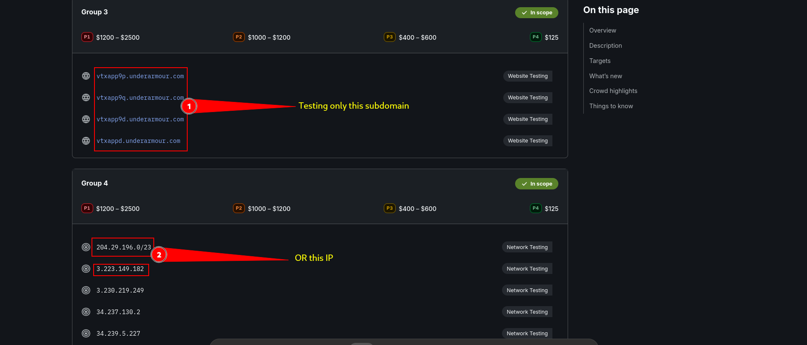
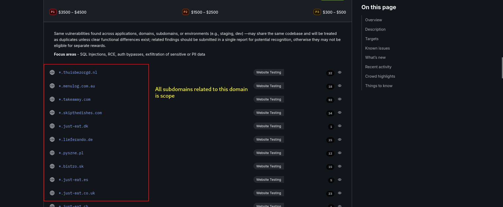
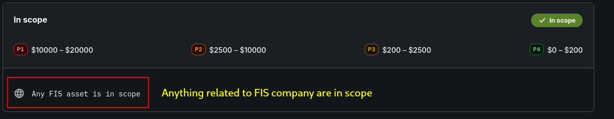
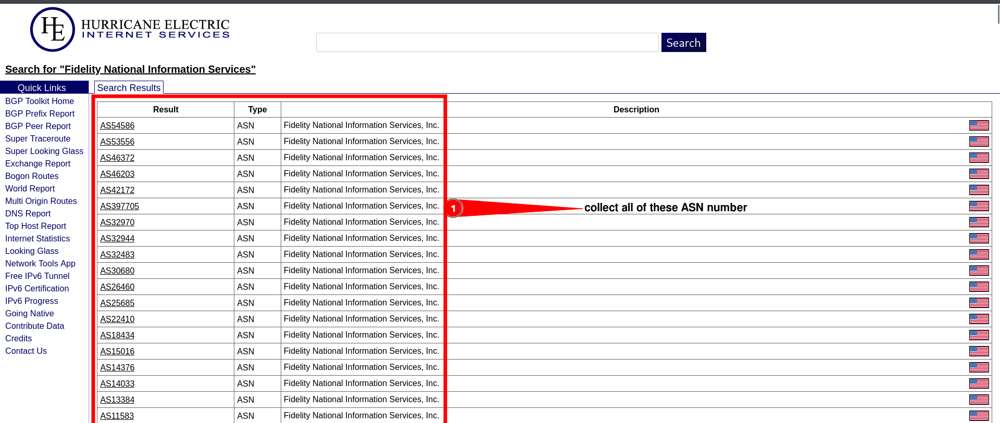
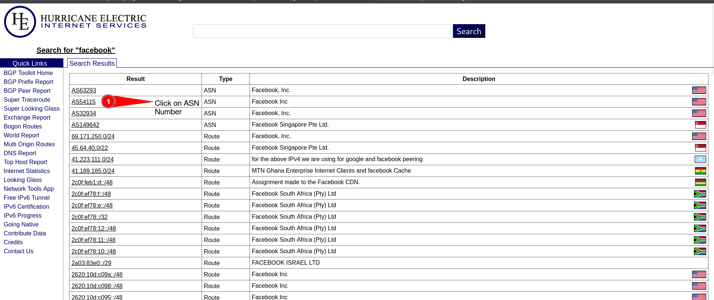
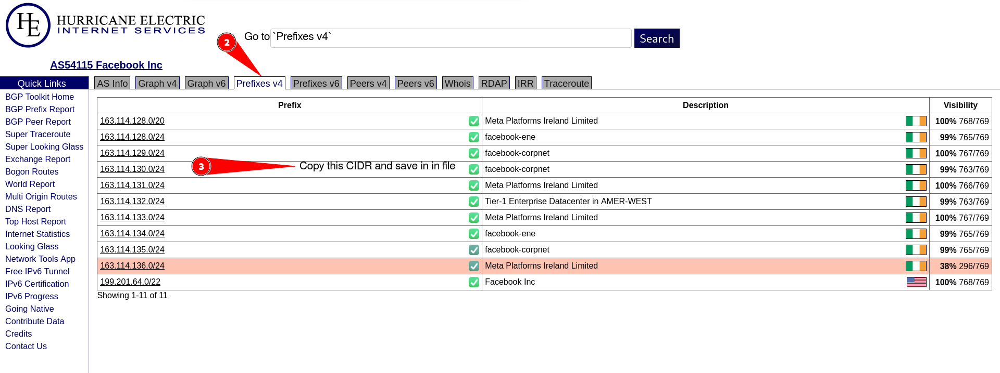
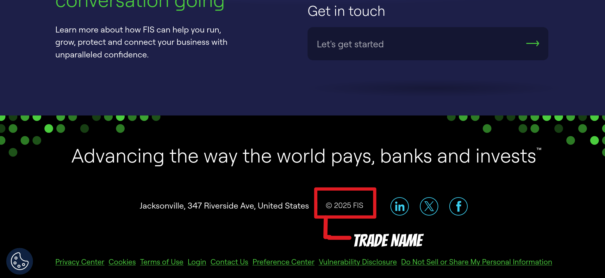

---
authors:
  - name: Yazeed Alewah 
    email: yazeedeliwah@gmail.com
    avatar: ../static/logo.png 

category: [Bug bounty & Recon]
date: 2025-08-27 
---


# Bug Hunting Methodology Part One


## Bug Hunting Methodology Types

### 1) Full Manual Methodology

The full manual method is for those who love understanding the application deeply. Hunters using this approach dive deep into a target, manually exploring every request, response, and parameter to find vulnerabilities. It’s time-intensive but allows for a thorough understanding of the target, often revealing issues automated tools might miss.

> **Some hunters using this methodology:**
> - Sohaib Nacri: [@h4x0r_dz](https://x.com/h4x0r_dz?lang=en)

### 2) The 50/50 Methodology

The 50/50 method blends manual and automated techniques. Start with reconning the application, finding untouched endpoints, then exploring the app and understanding it.

> **Some hunters using this methodology:**
> - Orwa Atyat: [@GodfatherOrwa](https://x.com/GodfatherOrwa)
> - Me XD: [@YazeedOliwah](https://x.com/Yazeed_oliwah)

### 3) Fully Automated Methodology

In this methodology, hunters automate everything—from reconnaissance to vulnerability scanning using public/custom scripts to cover massive attack surfaces quickly. While it may miss nuanced bugs, it’s perfect for identifying common vulnerabilities across large systems.

> **Some hunters using this methodology:**
> - Eric: [@todayisnew](https://x.com/codecancare)

### 4) 0Day Hunting

The 0Day Hunter method focuses on finding vulnerabilities in widely used software like Jenkins, WordPress, or Jira. These hunters monitor for newly disclosed CVEs or zero-days, then report them to programs using that software.

> **Some hunters using this methodology:**
> - Shubs: [@shubs](https://x.com/infosec_au)
## Recon Phase

We all know that reconnaissance, or recon, is critical in bug bounty hunting and web application pentesting. In fact, it’s often considered the most important phase. Why? Because effective recon sets the stage for everything else. Bug bounty hunters who master recon consistently uncover hidden assets, untouched features, and obscure endpoints that others overlook. This gives them a massive edge, significantly boosting their chances of finding high-impact security vulnerabilities and earning substantial rewards.

#### **What is Recon?**

Reconnaissance, in the context of bug bounty hunting, is the process of gathering as much information as possible about a target within its defined scope. Think of it as mapping out the battlefield before engaging. It involves identifying domains, subdomains, IP ranges, software, endpoints, and even forgotten or misconfigured assets that a company might not even realize are publicly accessible. The goal is to build a comprehensive picture of the target’s attack surface—every request, response, and parameter where a vulnerability might hide. The better your recon, the more likely you are to find unique bugs that others miss.

**NOTE:** Recon is not just collecting subdomains and IPs like many hunters think. It also involves trying to understand the application workflow and how it works.

## Scope-Based Recon

Scope-based recon involves adjusting your reconnaissance methodology based on the target’s defined scope in a bug bounty program. The best mind map I’ve stumbled upon for this is from the legend [@harshbothra_](https://xmind.app/m/hKKexj).

### Small Scope

A small scope is all about honing in on a single domain or URL like `target.com` or `sub.target.com` with no wildcard or subdomain inclusion. This is your chance to go deep, not wide, with a targeted recon effort.

**Example:** [Under Armour Corp](https://bugcrowd.com/engagements/underarmour-corp)  


### Medium Scope

A medium scope steps it up with subdomains or a wildcard (e.g., `*.target.com`) and related assets. This calls for a broader approach, blending automation to cover ground with manual effort to dig into the good stuff.

**Example:** [Just Eat Takeaway](https://bugcrowd.com/engagements/justeattakeaway)  


### Large Scope

A large scope is the big leagues—covering an entire organization, including related domains, acquisitions, IPs, and assets. This is the broadest and most complex challenge, demanding heavy OSINT, automation, and some manual testing.

**Example:** [Fisglobal](https://bugcrowd.com/engagements/fis)  


**NOTE:** I’ll break down the full methodology covering all scopes (technically a large scope XD) with step-by-step techniques, tools, and pro tips. Whether you’re a newbie or a seasoned pro, this will level up your recon game.

## ASN / CIDR Recon

### What's That?

**ASN (Autonomous System Numbers):** A unique number assigned to an organization (think big companies like Google, Apple, or your target company) that controls a chunk of IP addresses. This number helps route traffic across the web, and it’s gold for recon because it tells you which IP ranges a company owns.

**CIDR:** Shorthand for representing those IP ranges. Instead of listing every single IP, it uses a prefix like `192.0.2.0/24` to define a block. The `/24` part means 256 IPs (from `192.0.2.0` to `192.0.2.255`).

### How to Collect IPs and Subdomains from ASN / CIDR?

Here’s how you can turn ASN and CIDR data into a list of IPs.

#### Step 1: Find the ASN

Start by hunting down the target’s ASN. Big organizations usually have their own, and you can sniff it out with tools like:

- [bgp.he.net](https://bgp.he.net/): Search the company name (e.g., “Facebook”) to find their ASN (like `AS32934`).  
  

#### Step 2: Extract CIDR Ranges

Once you’ve got the ASN, grab the CIDR blocks. Tools like `bgp.he.net`, `whois`, or `asnmap` can pull these.

- [bgp.he.net](https://bgp.he.net/): After searching the company name, click on the ASN number to find CIDRs.  
  

  


- [whois]():
```bash
whois -h whois.radb.net -- '-i origin AS32934' | grep -Eo "([0-9.]+){4}/[0-9]+" | uniq

```
- [asnmap](github.com/projectdiscovery/asnmap):
```bash
 echo ASN | asnmap
```


#### Step 3: Generate IP Lists
Now, turn those CIDR blocks into individual IPs. Use prips, masscan, nmap:

- [prips]():

```bash
 for i in $(cat cidr.txt);do prips$i >> ip.txt;done
```
- [masscan](https://github.com/robertdavidgraham/masscan):
```bash
 masscan-p8080,8001,3389,8009,1311,2480,4444,4445,3333,4567,5000,5001,5104,5800,7000,7001,7002,8008,8042,8088,8222,8243,8280,8281,8333,8530,8531,8887, 8888,8443,8834,9080,9443,9981,12043,12046,16080,18091,10443,18092,1010,1311,2082,2087,2095,2096,3000,3128,4243,4711,4712,4993,5108,6543,7396,7474,8000,8001,8008,8014,8069,8080,8081, 8090,8091,8118,8088,8123,8172,8500,8880,8800,8983,9000,9043,9060,9090,9091,9200,9800,12443,20720,28017,0-1024 -iL cidr.txt -oL masscan.txt
 ```

 - [nmap](https://nmap.org/):
 ```bash
  nmap -T4 -Pn -p 80,4443,4080,443 --script=ssl-cert -iL cidr.txt -oX site-cidr-ssl-cert-scanned.xml --open
 ```

  ```bash
 nmap -T4 -Pn -p 80,4443,4080,443 --script=banner -iL cidr.txt -oX site-cidr-banner-scanned.xml --open
```

#### Step 4: Extra Enumeration 
we can also use shodan, urlscan and amass to find cool stuff
> [shodan](https://www.shodan.io/): asn:AS0000

> [shodan](https://www.shodan.io/): cidr:xxx.xxx.x.x/24

> [shodan](https://www.shodan.io/): net:xxx.xxx.x.x/24

> [urlscan](https://urlscan.io/): asn:As10001


## Domains, Subdomains, and Port Scanning

Let’s start with the basics. A **root domain** is the main or top-level domain of a website. For example, `target.com` or `target.cn` would be the root domain of a website.

A **subdomain** is a separate section of a website that is accessed through a prefix before the root domain, for example, `www.target.com` or `admin.target.com`.

### Step 1: Discover Domains

Let’s start with domain enumeration. First, you need to track down the target’s trade name (the official company name). Here’s how to nail it:

- Check the Main Website: Head to the target’s site, scroll to the footer, and look for the © symbol. It often lists the trade name (e.g., “© 2025 Target Corp”).  
  
- Inspect the Certificate: Click the lock icon in your browser, select “Connection is secure,” then “View Certificate.” Check the “Organization” field for the trade name.

[!embed](img/tradename2.mp4)
Now visit [crt.sh](https://crt.sh/), enter the trade name, copy the domains, and save them to `domain.txt`.


### Step 2: Enumerate Subdomains

Subdomains are where the real action is. Use these tools to map them out:

```bash
subfinder -dL domains.txt -o subfinder.txt
```

```bash
 amass enum -passive -norecursive -noalts -df domains.txt -o subdomains.txt
```
```bash
 cat domains.txt | assetfinder --subs-only >> assetfinder.txt
```

you can add/replace your tools also !


**Level Up Your Hunt**: Take your initial subdomain list (e.g., first-list-subdomain.txt) and send it back into Amass . This recursive trick uncovers deeper layers

```bash
 amass -passive -norecursive -noalts -df first-list-subdomain -o Finalsubdomain.txt
```


### Step 3: Port Scan

We want to scan all ports on your subdomains and IPs (from ASN/CIDR recon) to expose that massive attack surface.

**Scan for Subdomains:**

```bash
nabbu -list subdomain.txt -exclude-ports 80,443 -top-ports 1000 -o ports-SUBS.txt
```

**Scan for IPs:**
```bash
nabbu -list ip.txt -exclude-ports 80,443 -top-ports 1000 -o ports-IP.txt
```

### Filter Results

Let’s polish those results and focus on web services. I’ll concatenate subdomain/IP lists and ports into one mega-list, then split them for screenshots and tech detection:

```bash
cat subdomain | httpx -o live-screenshoot-subs.txt
cat subdomain | httpx -sc -cl -title -td -o live-subs.txt
```

```bash
cat ip.txt | httpx -o live-screenshoot-ip.txt
cat ip.txt | httpx -sc -cl -title -td -o live-ip.txt 
```

## Taming the Chaos with Large Targets

**So Far We Have:**

- Domains
- Subdomains
- IP Addresses
- Ports

With a large target, tracking all this can get wild! Now, we need to zero in on our targets of interest using technology detection and screenshots from `live-subs.txt` and `live-ip.txt`. Let’s refine our hunt:

- **Tech Hunting:** Dive into the tech stack you’re interested in—WordPress, MySQL, PHP, or whatever you’re interested in. Example: `cat live-subs.txt | grep -i "wordpress"` to find WordPress.
- **Subdomain Patterns:** Search for juicy subdomains like `admin.target.com`, `dev.target.com`, or `stage.target.com`. These often hide login pages or test environments.
- **Screenshot Everything:** Visiting every subdomain manually is a grind—and some might not even make sense at first glance. That’s why we will screenshot everything. Run `gowitness scan file -f live-subs.txt --write-db` to snap screenshots of all live subdomains. Do the same for IPs.
- **Filter Like a Pro:** Browse the screenshots folder to spot anomalies—login pages, outdated CMS versions, or misconfigs.

In Part 2, we’ll level up your skills with advanced recon techniques like vhost enumeration, favicon analysis, URL discovery, and Dorking.

# Enjoyed this?

Follow me on Twitter or Instagram for more hands-on bug bounty tips, fresh exploit case studies, and red team/pentest content.
